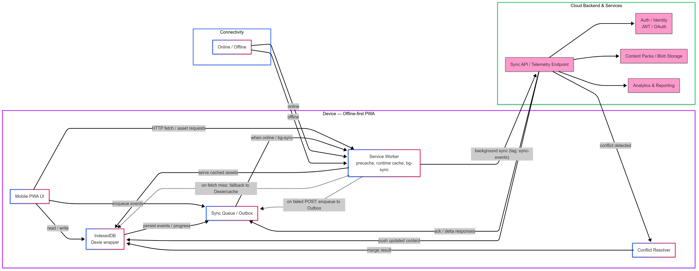

#️⃣ SANGYAAN — Smart Education Infrastructure for Digital India 🚀🇮🇳

SANGYAAN is an offline-first, gamified Progressive Web App (PWA) designed to bridge the rural education gap in India. It focuses on engagement, accessible STEM learning, and teacher-centred analytics — all optimized for low-cost Android devices.

✨ Core ideas: portable student profiles, verifiable badges (OpenBadges 3.0), modular content packs, multilingual UI (English / हिंदी / ଓଡ଼ିଆ), and teacher analytics.

---

## 🎯 Highlights

- Gamified learning: levels, XP, badges, mini-games and virtual labs 🏆🎮
- Offline-first: local-first storage with IndexedDB (Dexie), service worker caching, and background sync ⚡🗃️
- Teacher & parent dashboards: visual analytics, reports and classroom tools 📊👩‍🏫👨‍👧
- Lightweight & responsive: tuned for low-end Android phones and tablets 📱�️
- Multilingual: English + Hindi (Odia scaffolded) — extendable to other regional languages 🌐

---

## 🚀 Quick Start (Developer)

Run the app locally (from the `sangyaan` folder):

```bash
cd sangyaan
npm ci
npm run dev
```

Build for production:

```bash
cd sangyaan
npm run build
```

### Deployment options

- GitHub Pages — see `.github/workflows/deploy.yml` 🟢
- Netlify — configured by `netlify.toml` 🔁
- Vercel — `vercel.json` ▶️

## 📁 Where to look (key files)

- App root: `sangyaan/` (React + Vite)
- PWA entry: `sangyaan/index.html`, `sangyaan/public/manifest.json`
- Local DB: `sangyaan/src/db.js` (Dexie schema & helpers)
- Virtual labs & games: `sangyaan/src/components/VirtualLab.jsx`, `sangyaan/src/components/ChemistryLab.jsx`
- Quiz engine: `sangyaan/src/components/Quiz.jsx`
- Language system: `sangyaan/src/contexts/LanguageContext.jsx`
- Cloud stubs: `cloud/firebase.js`, `cloud/gpt_nano.js`
- Product docs: `files/PRD.txt`

---

## 🧩 Minimal MVP mapping

### Gamified modules (2–3 subjects)
- Physics simulations (gravity, motion): `VirtualLab.jsx` ⚙️
- Math puzzles (algebra, geometry): `Quiz.jsx` 🧮
- Chemistry matching: `ChemistryLab.jsx` 🔬

### Offline-first architecture
- IndexedDB via Dexie: `sangyaan/src/db.js` 🗃️
- PWA manifest + service worker scaffold: `sangyaan/public/manifest.json` + (recommended) `public/sw.js` 🖥️

### Analytics & dashboards
- Teacher dashboard: `sangyaan/src/components/TeacherDaashboard.jsx` 📊
- Parent dashboard: `sangyaan/src/components/ParentsDashboard.jsx` 👪

### UI & accessibility
- Tailwind configuration: `sangyaan/tailwind.config.js` 🎨
- Responsive components: `sangyaan/src/components/` 📱

---

## 🏗️ High-level architecture

Below is a simplified high-level architecture showing the offline-first flow, local storage, sync and cloud endpoints.



<details>
  <summary>Mermaid source (click to expand)</summary>

```mermaid
---
config:
  layout: dagre
  theme: neo
  look: neo
---
flowchart LR
 subgraph Device["Device — Offline-first PWA"]
    direction LR
        Browser["Mobile PWA UI"]
        SW["Service Worker<br>precache, runtime cache, bg-sync"]
        Dexie["IndexedDB<br>Dexie wrapper"]
        Outbox["Sync Queue / Outbox"]
        Resolver["Conflict Resolver"]
  end
 subgraph Network["Connectivity"]
        Net["Online / Offline"]
  end
 subgraph Cloud["Cloud Backend & Services"]
    direction TB
        API["Sync API / Telemetry Endpoint"]
        Auth["Auth / Identity<br>JWT / OAuth"]
        Storage["Content Packs / Blob Storage"]
        Analytics["Analytics & Reporting"]
  end
    Browser -- read / write --> Dexie
    Browser -- HTTP fetch / asset requests --> SW
    Browser -- enqueue events --> Outbox
    Dexie -- persist events / progress --> Outbox
    Outbox -- "when online / bg-sync" --> SW
    SW -- "background sync (tag: sync-events)" --> API
    SW -- serve cached assets --> Dexie
    API --> Auth & Storage & Analytics
    API -- ack / delta responses --> Outbox
    API -- conflict detected --> Resolver
    Resolver -- merge result --> Dexie
    API -- push updated content --> Dexie
    Net -- online --> SW
    Net -- offline --> SW
    SW -. on fetch miss: fallback to Dexie/cache .-> Dexie
    SW -. on failed POST: enqueue to Outbox .-> Outbox
     API:::cloud
     Auth:::cloud
     Storage:::cloud
     Analytics:::cloud
    classDef cloud fill:#f9c,stroke:#333,stroke-width:1px
    style Cloud stroke:#00C853
    style Network stroke:#2962FF
    style Device stroke:#AA00FF


```

</details>


## 📄 Contributing

Please read `sangyaan/README.md` first for app-level developer notes. Open issues for features or bugs and include device/browser details when reporting offline/sync issues.

## 📝 License

See repository for license information.

